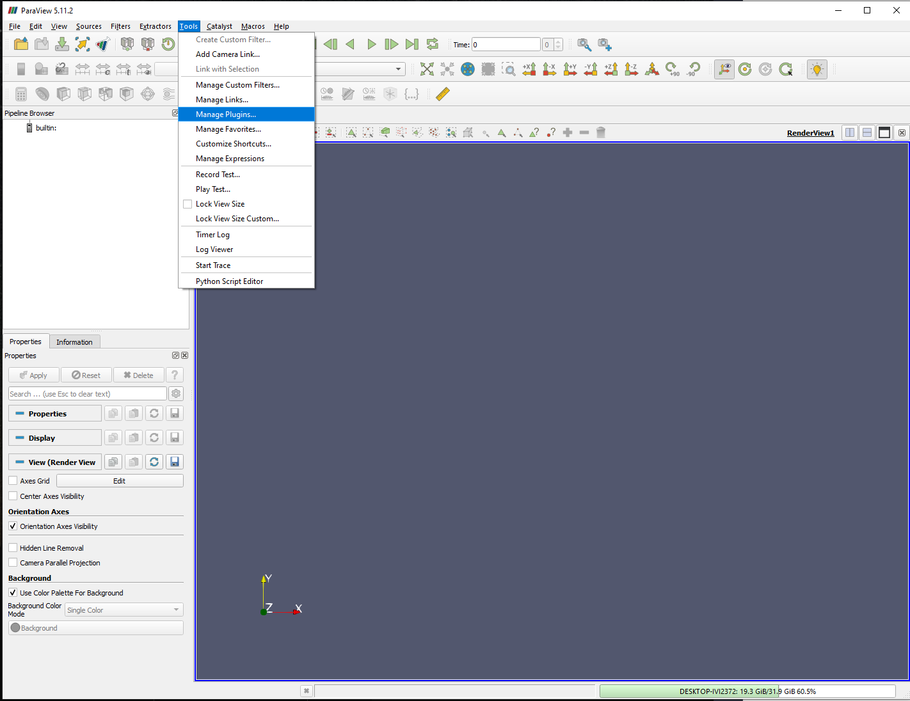

# Paraview

> Quick viewing of STL and INP files using Paraview

We need a more efficient way to view STL and INP files than using the GUI of Hypermesh. This project uses Paraview to quickly view STL and INP files, the way I've been doing it during my automatic meshing project.

## Installation

To install the [conda]/[mamba] package manager we're using to install Paraview, follow the [mamba] installation instructions:

1. Navigate to the [mamba installation] instructions page, which will contain a link to the [miniforge downloader repository].

2. Download the installer for the correct OS, under the *Miniforge3* heading

> Warning: You want Miniforge3, *NOT* Miniforge3-pypy3

3. Run the installer using the default "Just Me (recommended)" option.

4. Hit the Windows key and type "Miniforge Prompt" to open the Miniforge prompt.

5. Enter this into the Miniforge prompt:

   ```
   mamba init
   ```

   ```
   conda config --set auto_activate_base false
   ```

   ```
   conda config --set channel_priority strict
   ```

6. Close the Miniforge prompt and open a CMD prompt.

7. Navigate to the directory containing paraview.yml and paraview.lock.yml

   ```
   cd path/to/containing/folder
   ```

## Creating the Environment

In order to set up the necessary environment:

1. review and uncomment what you need in `environment.yml` and create an environment `paraview` with the help of [mamba] and [conda] with:

   ```
   mamba env create -f paraview.yml -n paraview
   ```
2. activate the new environment with:

   ```
   conda activate paraview
   ```

3. Run paraview with:

   ```
   paraview
   ```

## Creating a desktop shortcut

To create a desktop shortcut, we need to point our shortcut to a couple of paths:

1. Right click on the desktop and select "New > Shortcut", we need to locate some binaries before creating our location/target.

2. Discover where conda is installed

   ```
   conda env list
   ```

which will output something like this:

   ```
   paraview                 C:\Users\kalin\mambaforge\envs\paraview
   ```

3. Copy everything before the \envs\paraview part (C:\Users\kain\mamaforge in this example), and use it to create this shortcut location/target:

   ```
   C:\Windows\System32\cmd.exe /K C:\Users\kalin\mambaforge\condabin\activate.bat C:\Users\kalin\mambaforge\envs\core & paraview & exit
   ```

4. Click "Next", and name the shortcut "Paraview"

## Adding INP file viewing capabilities

Viewing INP files is handled by the meshio python package, and requires some manual setup in the Paraview GUI. The process involves opening the Paraview GUI, and navigating to the "Tools > Manage Plugins" menu. From there, we need to add the meshio plugin, which is located in a folder in within our python environment.

1. Open the Paraview GUI by running the shortcut we created earlier.

2. Navigate to "Tools > Manage Plugins"



3. Click "Load New" and navigate to the meshio plugin, which is located in the python environment we created earlier. The path will look something like this:

   ```
   C:\Users\kalin\mambaforge\envs\paraview\share\paraview-5.9\plugins\paraview-meshio-plugin.py
   ```

   > Note the root of the path is the same one we found using `conda env list` earlier, but this time we include the \envs\paraview part.

4. Once you have loaded the plugin, expand the newly created entry in the plugin list, and check the box next to "Auto Load"

  

5. Test that it works by loading the provided mesh files in the `meshes` folder.


6. You'll know if an error happens. To see the meshes, you must hit the green "Apply" button in the left side bar of the Paraview GUI.


7. Group them together by selecting them in the "Pipeline Browser" and hitting the "Group Datasets" button in one of the top bars (or hit ctrl+space and type "group" to search for it).


> Note: It can be a pain to select multiple items in the Pipeline Browser. If the top object is highlighted, click the bottom object first, and then shift+click the top object again. This will select all the objects in between.

8. Too view mesh edges, make sure you have selected a visible object, then scroll down and find the dropdown menu for "Representation" and select "Solid with Edges".


## Upgrading & Reproducibility

> Note: meshio did a major refactor following version 5.0.2, and we haven't gotten the newer versions to work. Paraview can be updated, until the

1. Always keep your abstract (unpinned) dependencies updated in `paraview.yml`

2. Create concrete dependencies as `paraview.lock.yml` for the exact reproduction of your
   environment with:
   ```bash
   conda env export -n paraview -f paraview.lock.yml
   ```
   For multi-OS development, consider using `--no-builds` during the export.

3. Update your current environment with respect to a new `environment.yml` using:
   ```bash
   conda env update -f environment.yml --prune
   ```

> Note: **Do not** overwrite paraview.lock.yml until you have thoroughly tested your updated environment file. It can be used to return to your previous environment if something goes wrong.

[mamba installation]: https://mamba.readthedocs.io/en/latest/mamba-installation.html#mamba-install
[miniforge downloader repository]: https://github.com/conda-forge/miniforge#miniforge3
[mamba]: https://mamba.readthedocs.io/
[conda]: https://docs.conda.io/
